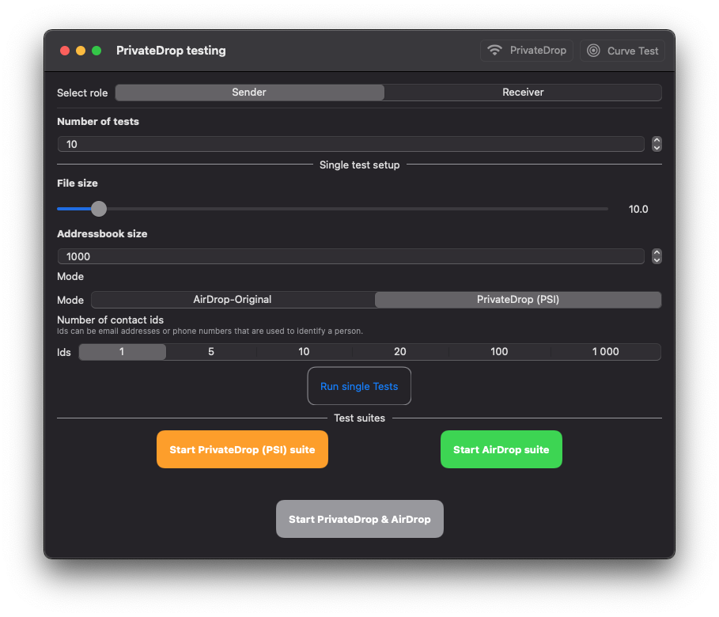

#  PrivateDrop:  Practical Privacy-Preserving Authentication for Apple AirDrop 

**Only use the *PrivateDrop.xcworkspace* to run the apps**

The code is based on PrivateDrop, which is a Python implementation of Apple's AirDrop that has been released in 2019. We updated the AirDrop protocol to increase the privacy level to users by using Private Set Intersection for matching contacts. 
This implementation is made in Swift, it includes all normal AirDrop features and is backwards compatible. Furthermore, it contains the extension PrivateDrop. This repository contains our testing apps that we used to evaluate the speeed of PrivateDrop in comparison to normal AirDrop. We have one iOS specific and on macOS specific apps. Both apps use SwiftUI to share large parts of the interface and functionality. 

## Installation 
Make sure to initialize the submodule 
```
git submodule init 
git submodule update
```

1. Then open the *PrivateDrop.xcworkspace*.
2. Select a scheme that you want to build, e.g. PrivateDrop Mac 
3. Go to Project -> Signing & Capabilities: Select your Apple developer team 
4. Press the run (play) button

## Testing 

To run a simple test that evaluates the PrivateDrop and AirDrop capabilities:
1. Install the app on two devices.
2. Setup one device as a sender and one device as a receiver.
3. Start one of the available test suites. 

## Apps

The iOS App is called "PrivateDrop iOS" and the macOS version is named "PrivateDrop Mac". The apps can be used to evaluate the speed of PrivateDrop by running the apps on two devices and setting one device up as a receiver and one as a sender. After starting a test suite the devices will connect with each other automatically to perform PrivateDrop to authenticate each other, followed by the normal AirDrop protocol including sending or receiving a file. These tests can be executed several times to identify the mean time later and remove issues from the outside, like network interference and resource hungry system processes. 

### User interface 

 

## Sender Setup 
The UI has several rows of settings which can be used for different test cases. 
1. Number of tests 
	- How often should a single test or a test suite be run?
2. Single test setup 
	- The following changes only apply for a single customized test case 
	- Addressbook size 
		- How many randomized contact entries does this sehder have 
	- Switch between the original AirDrop or an AirDrop implementation with PSI 
	- Switch between the number of Ids the sender device has
3. Test suites
	The app has three test suites:
	
	1. PrivateDrop: Runs only the PrivateDrop tests
	2. AirDrop: Runs only standard AirDrop
	3. PrivateDrop & AirDrop: Runs PrivateDrop tests and the AirDrop tests combined 

	Every suite contains multiple test cases. They change in the number of contacts in the address book and the number of contact identifiers that a user has. 

### Contact data and certificates 

To run AirDrop a certificate and so called record data is necessary. Together this authenticates the user and ensures and end-to-end encrypted communication between the sender and the receiver of a file. For private drop, we use pre-computed and signed PSI values that are necessary to ensure that the used contact identifiers are indeed owned by the user. For our test app, we added different sets of identifiers from 1 to 1,000 identifiers. These are pre-signed and they also contain the needed certificates and record data from Apple. To use the test apps, you do not need to add/create/delete any certificates and signed data. 


## PrivateDrop Base Framework 
This project contains a sub-project named "PrivateDrop Base". This is a Swift Framework that contains all necessary code to run AirDrop and PrivateDrop. The framework itself contains several statically linked libraries to perform certain functions, e.g. elliptic curve cryptography.

To get more information on the details of this framework, check out the Readme in the folder privatedrop-base. 

## Usenix Paper 
This work is part of our paper on **PrivateDrop**. <br>
Alexander Heinrich, Matthias Hollick, Thomas Schneider, Milan Stute, and Christian Weinert, TU Darmstadt. **PrivateDrop: Practical Privacy-Preserving Authentication for Apple AirDrop** Proceedings on 30th USENIX Security Symposium. [📄 Link](https://www.usenix.org/conference/usenixsecurity21/presentation/heinrich).
